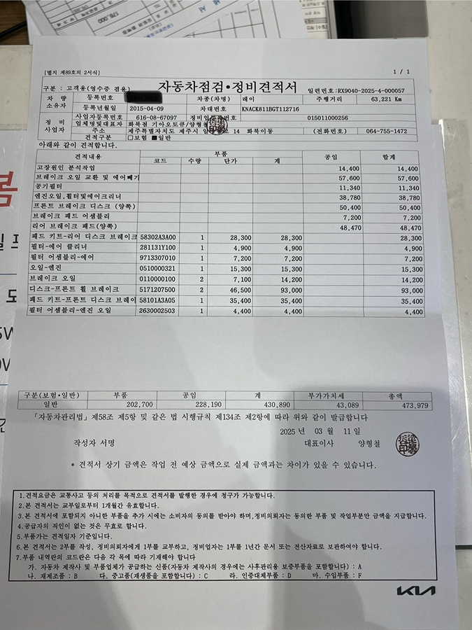
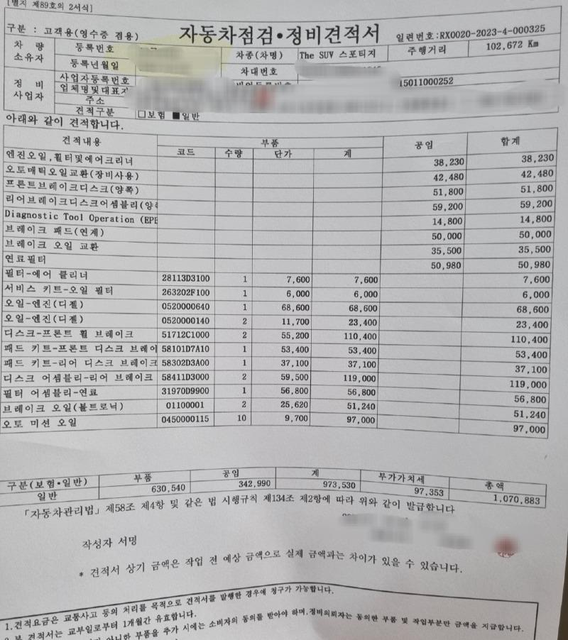

# 🚗 자동차 정비 견적서 검증 스킬

> **정비소에서 받은 견적서 사진 한 장이면, 항목별 적정성을 자동으로 검증합니다.**

[](https://opensource.org/licenses/MIT)
[](https://upstage.ai)
[](https://claude.ai/code)

---

## TL;DR

자동차 정비 견적서(JPG/PNG)를 첨부하면, **Upstage OCR**로 항목을 추출하고 **공임나라 표준 공임비**·**현대모비스 순정 부품 정가**·**실시간 웹 검색**을 종합해 각 항목의 시장 대비 편차(%)를 계산합니다. 결과는 한국어 마크다운 리포트로 즉시 전달됩니다.

---

## 🎯 이 스킬이 해결하는 문제

정비소에서 받은 견적서를 보고 "이거 바가지 아닌가?" 싶어도, 일반 운전자는 공임비·부품가의 시장 적정선을 알기 어렵습니다. 항목 하나하나를 검색해 비교하는 것도 현실적으로 불가능합니다.

이 스킬은 **견적서 사진 한 장만 받으면**, 항목별 단가를 시장 기준(공임나라·현대모비스)과 자동으로 대조하고, 편차가 큰 항목을 색상 등급으로 표시한 정량적 리포트를 생성합니다.

---

## ✨ 주요 기능

- 📸 견적서 사진(JPG/PNG)에서 항목 자동 추출 — Upstage Information Extract
- 💰 **공임나라** 표준 공임비 실시간 조회
- 🔧 **현대모비스** 순정 부품 정가 실시간 조회 (부품번호 우선 매칭)
- 🌐 매칭 실패 항목은 에이전트가 **웹 검색으로 시장가 보강**
- 📊 항목별 편차(%) 계산 + **6단계 색상 판정** (🟢 적정 / 🟡 다소 높음 / 🟠 높음 / 🔴 매우 높음 / 🔵 다소 낮음 / 🔵 낮음)
- 📄 다중 페이지 견적서 지원, 차량 정보 누락 시 자동 보정 질문

---

## 🚀 빠른 시작 (5분이면 충분)

### 0단계 — 사전 요구사항

| 도구                                  | 비고                                                      |
| ------------------------------------- | --------------------------------------------------------- |
| [Claude Code](https://claude.ai/code) | 스킬 실행 환경                                            |
| Python 3.9+                           | 파이프라인 스크립트 실행                                  |
| Upstage API 키                        | [console.upstage.ai](https://console.upstage.ai)에서 발급 |

### 1단계 — 저장소 Clone

```bash
git clone https://github.com/<your-username>/JNU-Upstage-Skillthon
cd JNU-Upstage-Skillthon
```

### 2단계 — Upstage API 키 설정

```bash
cp skills/car-repair-estimate-validator/assets/.env.example \
   skills/car-repair-estimate-validator/assets/.env
```

생성된 `.env` 파일을 에디터로 열어 본인 키를 채워 넣습니다.

```
UPSTAGE_API_KEY=up_xxxxxxxxxxxxxxxxxxxx
```

> 💡 `.env.example`은 단순 템플릿이며 코드가 직접 읽지 않습니다. 반드시 `.env`라는 이름으로 저장돼 있어야 합니다.

### 3단계 — 의존성 설치

```bash
pip install openai python-dotenv requests playwright
playwright install chromium
```

> Playwright는 현대모비스 부품가 조회에 사용됩니다. `playwright install chromium`을 빠뜨리지 마세요.

### 4단계 — Claude Code 세션 시작

```bash
claude .
```

### 5단계 — 트리거 문장 입력

아래 두 방법 중 하나로 스킬을 발동시킵니다.

**방법 A — 제공된 샘플 이미지로 즉시 체험:**

```
견적서 검증해줘. 파일: skills/car-repair-estimate-validator/references/examples/ray.png
```

또는

```
이 견적서 바가지 아닌지 봐줘 → skills/car-repair-estimate-validator/references/examples/sportage.jpeg
```

**방법 B — 본인이 가진 견적서 사진 첨부:**

Claude Code 프롬프트에 이미지를 드래그·드롭(또는 클립보드 붙여넣기) 후, 다음과 같은 문장을 함께 입력합니다.

```
이 정비 견적서가 적정한지 분석해줘
```

> 트리거 키워드: `"견적서 검증해줘"`, `"정비 견적서 확인해줘"`, `"이 견적서 바가지 아닌지 봐줘"`, `"정비 비용이 적정한지 알고 싶어"`, `"견적서 사진 분석해줘"` — 이 표현 중 하나가 포함되면 Claude가 자동으로 스킬을 선택합니다.

---

## 🧪 체험용 샘플 이미지

별도의 견적서가 없어도 아래 두 장의 샘플 이미지로 스킬을 바로 체험할 수 있습니다. 두 이미지 모두 **실제 정비소가 발행한 견적서**를 비식별화한 자료입니다.

| 파일                                                                     | 차량                              | 비고                                     |
| ------------------------------------------------------------------------ | --------------------------------- | ---------------------------------------- |
| `skills/car-repair-estimate-validator/references/examples/ray.png`       | 기아 레이 (2015년식, 63,221km)    | 브레이크·필터·오일 위주 점검·정비        |
| `skills/car-repair-estimate-validator/references/examples/sportage.jpeg` | 기아 스포티지 The SUV (102,672km) | 디스크·패드 키트·오토미션 오일 등 다항목 |

<table>
<tr>
<td align="center" width="50%">
<br>
<sub><b>ray.png</b> — 기아 레이 (2015)</sub>
</td>
<td align="center" width="50%">
<br>
<sub><b>sportage.jpeg</b> — 기아 스포티지 The SUV</sub>
</td>
</tr>
</table>

> ℹ️ `references/examples/` 폴더는 데모용입니다. 런타임 파이프라인(`scripts/*.py`)은 이 폴더의 내용을 절대 참조하지 않으며, 사용자가 명시적으로 경로를 지정해 입력할 때만 사용됩니다.

---

## 📊 결과물 구조

스킬을 발동하면 아래와 같은 **구조**의 한국어 마크다운 리포트가 생성됩니다. 실제 값(금액·편차·항목명)은 첨부한 견적서와 실시간 시세 조회 결과로 채워집니다.

> ℹ️ 아래 표의 셀 값은 모두 **자리표시자**입니다. 실제 출력에는 견적서에서 추출된 항목명·금액과 공임나라/모비스의 실시간 시세, 그리고 계산된 편차(%)·판정 등급이 들어갑니다.

> ### 자동차 정비 견적서 검증 리포트
>
> **기본 정보**
>
> - 차량: `<차량명·연식>`
> - 견적 총액: `XXX,XXX원`
>   - 부품: `XXX,XXX원` / 공임: `XXX,XXX원`
> - 검증 항목: 전체 `N`개 중 공임 `n`개, 부품 `n`개 비교 가능 (`XX`%)
>
> **종합 판정**
>
> **🟢 / 🟡 / 🟠 / 🔴 — `<판정 라벨>` (전체 편차 ±X.X%)**
>
> > 종합 판정 요약 문장이 들어갑니다. (편차가 큰 경우 정비소 문의·재견적 권장 등 행동 가이드 톤)
>
> **공임 비교**
>
> | 항목            | 견적 공임 | 공임나라 기준 | 편차  | 판정              |
> | --------------- | --------- | ------------- | ----- | ----------------- |
> | `<정비 항목 1>` | XX,XXX원  | XX,XXX원      | ±X.X% | 🟢 적정           |
> | `<정비 항목 2>` | XX,XXX원  | XX,XXX원      | ±X.X% | 🟡 다소 높음      |
> | `<정비 항목 3>` | XX,XXX원  | XX,XXX원      | ±X.X% | 🟠 높음 / 🔴 매우 높음 |
> | …               | …         | …             | …     | …                 |
>
> **부품 비교**
>
> | 항목                          | 수량 | 견적 부품비 | 모비스 정가 | 편차  | 판정         |
> | ----------------------------- | ---- | ----------- | ----------- | ----- | ------------ |
> | `<부품명> (<부품번호>)`       | n    | XX,XXX원    | XX,XXX원    | ±X.X% | 🟢 적정      |
> | `<부품명> (<부품번호>)`       | n    | XX,XXX원    | XX,XXX원    | ±X.X% | 🔵 다소 낮음 |
> | `<부품명>` (부품번호 미상)    | n    | XX,XXX원    | XX,XXX원    | ±X.X% | 🟡 다소 높음 |
> | …                             | …    | …           | …           | …     | …            |
>
> **비교 불가 항목** *(있을 경우)*
>
> - `<항목명>` — 공임나라/모비스 직접 매칭 불가 → 에이전트 웹 검색으로 시장 참고가 보충
>
> **종합 제안**
>
> - 🟠 *(편차가 큰 공임 항목)* — "정비소에 단가 산정 근거(시간당 단가 × 작업시간) 요청, 또는 다른 정비소와 비교 견적 권장" 톤의 행동 가이드
> - 🔵 *(시장가보다 낮은 부품 항목)* — "호환·재생 부품 가능성. 부품 코드의 등급 표기(A/B/C/D) 확인 권장" 톤의 행동 가이드
> - 🔴 *(이상치로 의심되는 항목)* — "비순정 의심. 부품 코드와 견적가 산정 근거 정비소에 질의 권장" 톤의 행동 가이드

---

## 🎨 편차 판정 기준

| 편차        | 판정         | 의미                                 |
| ----------- | ------------ | ------------------------------------ |
| -5% ~ +5%   | 🟢 적정      | 시장 기준 범위 내                    |
| +5% ~ +15%  | 🟡 다소 높음 | 확인 권장                            |
| +15% ~ +30% | 🟠 높음      | 정비소 문의 권장                     |
| +30% 이상   | 🔴 매우 높음 | 다른 견적 비교 강력 권장             |
| -5% ~ -15%  | 🔵 다소 낮음 | 호환 부품 가능성                     |
| -15% 이하   | 🔵 낮음      | 재생/호환 부품 또는 묶음 할인 가능성 |

---

## 🏗️ 동작 원리

```
견적서 사진 (JPG/PNG)
    │
    ▼
① OCR 추출           — Upstage Information Extract
    │
    ▼
② 차량 모델 매칭     — Solar Chat + 모비스 모델 486개 번들
    │
    ▼
③ 시세 조회 (병렬)
   ├─ 공임나라 표준 공임비 (AJAX POST)
   └─ 현대모비스 순정 부품가 (Playwright)
    │
    ▼
④ 동의어 사전 재매칭 — 미매칭 항목 보강
    │
    ▼
⑤ 편차 계산 + 판정    — 6단계 색상 등급
    │
    ▼
⑥ 마크다운 리포트
    │
    ▼ (비교불가 항목이 있을 경우)
⑦ 에이전트 웹 검색으로 시장가 보충 → 최종 리포트
```

---

## 🛠️ 기술 스택

- **OCR**: [Upstage Information Extract](https://console.upstage.ai/docs/capabilities/information-extract)
- **차량 매칭**: Upstage Solar Chat + 현대모비스 모델 목록 (486개 번들링)
- **공임 조회**: 공임나라(gongim.com) 웹 조회 (requests, AJAX POST)
- **부품 조회**: 현대모비스(mobis-as.com) 간단검색 (Playwright stealth)
- **동의어 매핑**: 공임/부품 동의어 사전으로 매칭률 향상
- **검증 엔진**: 편차 계산 + 매칭 신뢰도 필터 + 한국어 제안 생성 (순수 Python, 외부 API 없음)
- **비교불가 항목 보충**: 에이전트 실시간 웹 검색
- **리포트**: 마크다운 (외부 API 없음)

상세 설계는 [`skills/car-repair-estimate-validator/references/architecture.md`](skills/car-repair-estimate-validator/references/architecture.md) 참조.

---

## 📁 프로젝트 구조

```
JNU-Upstage-Skillthon/
├── README.md                          ← 지금 보고 있는 파일
└── skills/
    └── car-repair-estimate-validator/
        ├── SKILL.md                   # 스킬 명세 (Claude가 자동 로드)
        ├── scripts/                   # 파이프라인 (Python)
        │   ├── run_pipeline.py        # 진입점
        │   ├── parse_estimate_ie.py   # OCR (Upstage Information Extract)
        │   ├── match_vehicle_model.py # 차량 매칭 (Solar Chat)
        │   ├── lookup_gongim.py       # 공임나라 조회
        │   ├── lookup_mobis.py        # 모비스 조회 (Playwright)
        │   ├── smart_lookup.py        # 항목 매핑 + 조회 오케스트레이션
        │   ├── enhance_with_synonyms.py
        │   ├── verify_estimate.py     # 편차 계산·판정
        │   └── generate_report.py     # 마크다운 리포트
        ├── references/                # 참조 데이터 (런타임 로드)
        │   ├── architecture.md
        │   ├── mobis-models.json      # 486개 차량 모델
        │   ├── standard-repair-times.json
        │   ├── labor-synonyms.json
        │   ├── parts-synonyms.json
        │   ├── parsed-estimate-schema.json
        │   ├── parsed-estimate-flat-schema.json
        │   └── examples/              # 데모용 이미지 (런타임 미참조)
        │       ├── ray.png
        │       └── sportage.jpeg
        └── assets/
            ├── .env.example           # 키 템플릿
            └── .env                   # 실제 키 (Git 제외)
```

---

## ⚠️ 알려진 한계

- **PDF 미지원**: JPG/PNG 이미지만 처리됩니다.
- **모비스 봇 차단**: IP 차단 발생 시 부품번호 검색만 재시도하며, 부품명 검색은 에이전트 웹 검색으로 자동 폴백합니다.
- **차량 모델 범위**: 차량명이 모비스 모델 목록(486개)에 없으면 부품명 매칭이 불가하지만, 부품번호가 있는 항목은 그대로 조회 가능합니다.
- **시세 변동**: 공임나라·모비스 가격은 실시간 조회이지만, 지역·정비소 등급·부품 등급(순정/호환/재생)에 따라 실제 가격과 차이가 있을 수 있습니다.

---

## 📄 라이선스

[MIT License](https://opensource.org/licenses/MIT)

---

<sub>이 프로젝트는 **JNU × Upstage Skillthon 2026** 출품작입니다. Powered by [Upstage Solar](https://upstage.ai), built with [Claude Code](https://claude.ai/code).</sub>
